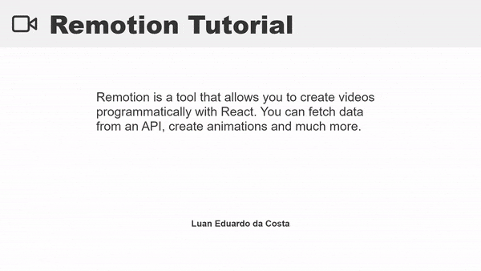

# :movie_camera: remotion-create-tutorial-videos

Create simple tutorial videos programmatically with React and [Remotion](https://www.remotion.dev/).



<p>
  

  

  

   <a href="https://github.com/luanedcosta/remotion-create-tutorial-videos/commits/master">
    
  </a>

  <a href="https://github.com/luanedcosta/remotion-create-tutorial-videos/issues">
    
  </a>
</p>

---

## :page_with_curl: About

This project contais some video templates created with React that you can use to create simple tutorial videos. This was the first test i made with the Remotion and i have some ideas of what to do next.

## :rocket: How to run

1. Follow the installation steps at: https://www.remotion.dev/docs/
2. From your command line:

```bash
# Clone this repository
$ git clone https://github.com/LuanEdCosta/remotion-create-tutorial-videos.git

# Go into the repository
$ cd remotion-create-tutorial-videos

# Install dependencies
$ yarn install

# Run the project
$ yarn start
```

## :man: Author

Luan Eduardo da Costa | luan1346@gmail.com
